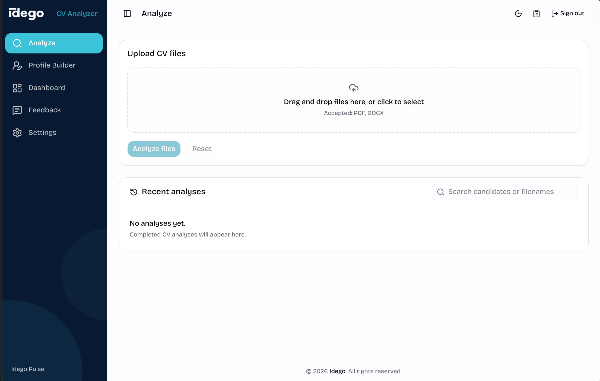

# CV Analyzer

Review CVs, explore relevant public sources, and turn candidate experience into editable profiles for clients.



[Quick start](#quick-start) · [Profile Builder](#profile-builder) · [Development](#development) · [Operations](docs/operations.md)

## What you can do

| Workspace | What it helps you do |
| --- | --- |
| **Analyze** | Upload PDF or DOCX CVs, review structured candidate information and findings, and search saved analyses. |
| **Profile Builder** | Edit candidate profiles, choose a template, hide selected personal details, and export DOCX or PDF. |
| **Dashboard** | See processing activity and estimated AI usage costs. |
| **Feedback** | Report issues in context and review them with your team. |
| **Settings** | Adjust public research, report display, retention, and shared profile fields. |

The app supports recruiter review. It does not make hiring decisions or verify a candidate's identity, location, or work eligibility.

## Analyze a CV

Upload one or more CVs with selectable text. The app extracts profile, employment, and education information, checks it against the document, and presents a report you can review alongside the original.

Optional public research looks for company, education, and possible LinkedIn matches. It uses accepted information from the CV, shows sources, and lets you retry failed requests. Certificates are excluded from automated education research. Public matches are leads for manual review.

Completed analyses stay in your history until you delete them or retention removes them. You can reopen the original document, search candidates or filenames, and leave feedback on report sections.

## Profile Builder

Turn up to 10 CVs at a time into editable profiles:

1. **Convert** PDF or DOCX files into structured content.
2. **Edit** experience, education, skills, and other profile fields.
3. **Choose a template** or create one with your own layout, styles, and logo.
4. **Choose what to share** by hiding selected personal details from the output.
5. **Export** an editable DOCX or a PDF, then return to saved profiles when needed.

AI summary, editing, and translation tools show proposed changes for review before you apply them. **My preferences** holds your defaults for new profiles, including the template, date format, anonymization, and file names.

The document preview uses the exported PDF. Templates can be private or shared with the team. Hiding structured fields does not remove identifying details from free text, so review descriptions and custom fields before sharing.

## Quick start

You need Docker with Compose, Make, an OpenAI API key, and at least **3 GiB of free disk space** for geographic reference data, in addition to the container images.

**1. Create your local configuration.**

```bash
cp .env.example .env.local
```

Set `OPENAI_API_KEY` and replace `BETTER_AUTH_SECRET` with a random secret of at least 32 characters in `.env.local`. Keep this file private.

**2. Start the app.**

```bash
make dev
```

Open [localhost:3000/analyze](http://localhost:3000/analyze). Local development bypasses sign-in for a loopback BASE_URL. The first start downloads and builds the GeoNames indexes; this can take several minutes. Later starts reuse them.

**3. Stop when you are done.**

```bash
make dev-down
```

This stops the stack and keeps its data volumes.

> Upgrading an existing installation? Read the [upgrade instructions](docs/operations.md#consolidated-branch-upgrade) first. Back up both application and authentication volumes, and preserve the existing auth secret during migration.

## How it works

The web app runs on **Next.js**. A private **FastAPI** service converts documents with **Docling**, runs the analysis, and stores reports and profiles in **SQLite**.

For CV analysis, separate model passes extract profile, employment, and education information. Validation checks literal evidence and whether record fields belong together. A reviewer pass then proposes changes under the same validation rules. Optional public research runs on accepted subjects.

Profile Builder is a separate workflow with its own editable profile and template snapshots. It generates DOCX files and uses **LibreOffice** for PDF export. The Docker image includes LibreOffice; PDF previews use self-hosted assets.

See the [technical guide](docs/technical-guide.md) for model configuration, pipeline details, diagnostics, caching, and runtime behavior, or the [architecture](docs/architecture.md) for system boundaries and contracts.

## Data and limitations

- **Text-bearing PDF and DOCX only.** Scans and image-only documents are unsupported; OCR is disabled.
- **AI credentials are required for analysis.** Missing credentials produce an unavailable state. Saved-profile editing and DOCX export remain available without AI.
- **OpenAI response storage is disabled** with `store=false`. CV text and raw model output must not enter logs.
- **Original uploads follow analysis retention.** They are available to the owner for preview and are removed with the analysis.
- **Feedback and AI accounting have separate lifecycles.** Feedback includes the author's email and the report context under review; it survives analysis deletion. The usage ledger keeps token counts and estimated costs without CV content.
- **Costs are estimates.** The ledger includes analysis, research, and Profile Builder calls, with versioned pricing and cache accounting.

## Development

The containers provide the full runtime. For frontend work outside Docker, use **Node 22.13+** and **pnpm**. The API uses Python; dependency details are in [pyproject.toml](apps/api/pyproject.toml).

| Task | Command |
| --- | --- |
| Start the stack | `make dev` |
| Stop the stack | `make dev-down` |
| Backend tests | `cd apps/api && PYTHONPATH=src .venv/bin/pytest -q` |
| Web tests | `cd apps/web && pnpm test` |
| Web typecheck | `cd apps/web && pnpm typecheck` |
| Web build | `cd apps/web && pnpm build` |

Local API documentation is available at [127.0.0.1:8001/docs](http://127.0.0.1:8001/docs). Production keeps the API private; browser requests go through the web app.

## Deploy and maintain

Production uses Docker Compose. Configure `.env` and put a TLS reverse proxy in front of the published web port. Then run `make deploy-check` and `make deploy`.

| Guide | Covers |
| --- | --- |
| [Operations](docs/operations.md) | Environment setup, deployment, backups, upgrades, rollback, retention, and feedback access. |
| [Technical guide](docs/technical-guide.md) | Detailed analysis behavior, model passes, diagnostics, caching, privacy, and runtime configuration. |
| [Architecture](docs/architecture.md) | Analysis pipeline, evidence rules, storage, and Profile Builder boundaries. |
| [GeoNames reference data](docs/reference-data/geonames.md) | Offline setup, index refresh, recovery, and snapshot versions. |
| [Web development](apps/web/README.md) | Frontend setup and conventions. |
| [Feature specifications](openspec/specs/) | Current behavior contracts. |
